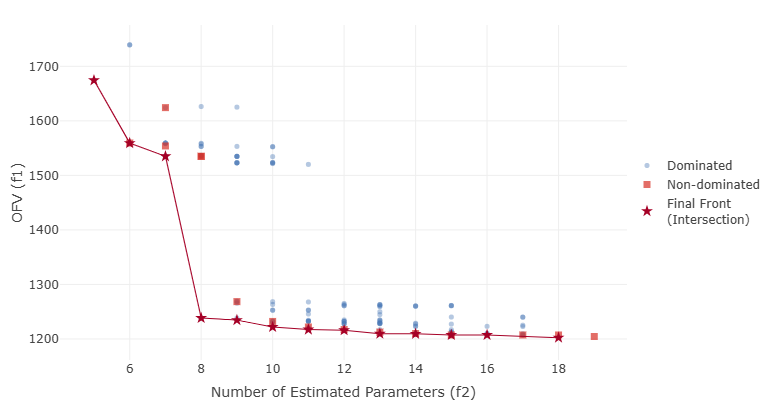
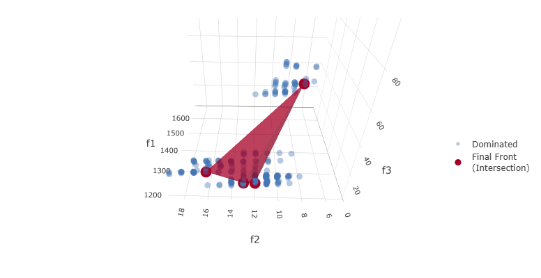

.. _The Algorithms:

###############
Algorithms
###############

For problems with larger search spaces, and greater number of model evaluations, :ref:`Genetic algorithm<GA_desc>` or :ref:`Random Forest <RF_desc>` may 
be more appropriate.

Below is a list of recommendations for algorithm selection.

 - Short model run times, large search space (> 100,000 models, expected sample > 1000 models) – :ref:`GA<GA_desc>`, :ref:`RF<RF_desc>`, :ref:`GBRT<GBRT_desc>`, or :ref:`PSO<PSO_desc>`
 - Small search space (<100,000, expected # of samples < 1000) - :ref:`Gaussian Process<GP_desc>`.
 - Very small search space (< 500 models), many cores (> 20) – :ref:`Exhaustive Search <EX_desc>`.

.. _EX_desc:

*******************
Exhaustive Search
*******************

The exhaustive search algorithm is simple to understand. The search space is initially represented as a string of integers - one for each dimension. To facilitate the search, 
this integer string is coded into a "minimal binary". Since all candidate models are executed in an exhaustive search, this algorithm is best suited for small search spaces.
 
.. _GA_desc:

*******************
Genetic Algorithm
*******************

Genetic Algorithm (GA) is a reproduction of the mathematics of evolution/survival of the fittest. A more detailed discussion `on GA can be found here <https://en.wikipedia.org/wiki/Genetic_algorithm>`_, and 
a very readable (but somewhat dated) reference is Genetic Algorithms in Search, Optimization and Machine Learning 13th ed. Edition by David Goldberg. Details of the options (not all of which are available in pyDarwin) 
can be found `here <https://deap.readthedocs.io/en/master/>`_.
Briefly, GA presents the search space as a bit string, with each "gene" being a binary number that is decoded into the integer value for that option. For example, for a dimension of Additive vs Additive + proportional 
residual error, the integer codes would be:

#. Additive error (e.g., +EPS(1))
#. Additive + proportional error (e.g., EXP(EPS(1))+EPS(2))

It is straightforward enough to code these values [1,2] into a binary [0,1]. For dimensions with more than 2 values, more than 1 bit will be needed. For example, if 1 or 2 or 3 compartments are searched, the 
string representation might be:

#. One compartment (ADVAN1)
#. Two compartment (ADVAN3)
#. Three compartment (ADVAN11)

and the bit string representation might be:

* 1 - [0,0]
* 2 - [0,1] and [1,0]
* 3 - [1,1]

The bit strings for each gene are concatenated into a "chromosome". The search starts with a population of random bit strings. These bit strings are decoded, and NONMEM control files are constructed from the :ref:`template file<template>` 
by substituting the selected text from the :ref:`token set<token set>`. The resulting NONMEM control file is run and the :ref:`fitness <fitness>` is calculated. 
The next generations is created by randomly selecting sets of parent candidates from the population. These parent candidates are then selected based on :ref:`Tournament selection <Tournament selection>`. 
Once the sets of parents are selected, they undergo crossover and mutation, and a new generation is created. This process is repeated until no further improvement is seen.

.. _GP_desc:

*******************
Gaussian Process
*******************

Gaussian Process is one of the two options used in `Bayesian Optimization <https://en.wikipedia.org/wiki/Bayesian_optimization#>`_. The Gaussian Process specifies the form of the prior and posterior distribution. 
Initially the distribution is random, as is the case for all the global search algorithms. Once some models have been run, the distribution can be updated (the "ask" step) and new, more informative samples can be
generated (the "tell" step).

.. _RF_desc:

*******************
Random Forest
*******************

`Random Forest <https://en.wikipedia.org/wiki/Random_forests>`_ consists of splitting the search space (based on the "goodness" of each model in this case), thus continuously dividing the 
search space into "good" and "bad" regions. As before, the initial divisions are random, but become increasingly well-informed as real values for the fitness/reward of models are 
included.

.. _GBRT_desc:

******************************
Gradient Boosted Random Tree
******************************

`Gradient Boosted Random Tree <https://towardsdatascience.com/decision-trees-random-forests-and-gradient-boosting-whats-the-difference-ae435cbb67ad>`_ 
is similar to Random Forest, but may increase the precision of the tree building by progressively building the tree and calculating a gradient of the reward/fitness with respect to each decision. 

.. _PSO_desc:

**********************************
Particle Swarm Optimization (PSO)
**********************************

Particle swarm optimization (PSO [#f4]_) is another approach to optimization that, like Genetic Algorithm,
attempts to reproduce a natural optimization process. In the case of PSO, the natural process is the
swarm behavior of birds and fish, although the specifics of the relationship to bird and fish behavior
is largely speculation. Each particle (candidate NONMEM model in this case) moves through the search
space, as one might imagine individuals in a school of fish or a flock of birds moving together,
but also each bird/fish moving somewhat independently.

The velocity of each particle's movement is based on two factors:

#. Random movement
#. Coordinated movement.

The coordinated movement is in turn, defined by the following parameters in the :ref:`Options List<Options>`:

* :ref:`inertia<inertia_options_desc>` (:math:`\\w`): the particle tends to continue moving in the same direction as the previous velocity
* :ref:`cognitive<cognitive_options_desc>` (:math:`c_1`): the particle tends to move in the direction toward its own best known position
* :ref:`social<social_options_desc>` (:math:`c_2`): the particle tends to move in the direction toward the current best known position among all particles

Other parameters for PSO include: :ref:`population_size <population_size_options_desc>`, :ref:`neighbor_number <neighbor_num_options_desc>`,
:ref:`p_norm <p_norm_options_desc>`, and :ref:`break_on_no_change <break_on_no_change_options_desc>`.

As with other optimization algorithms, the downhill step may also be implemented.
The topology defines the region of the swarm whereby individual particles (models in this case) exchange information and thereby act in coordination.
The "star" topology is the only implementation currently available in pyDarwin. The star topology permits particles (i.e., models) to coordinate with a set of nearest neighbors in a
sort of star shape, up to the number of neighbors specified in :ref:`neighbor_number <neighbor_num_options_desc>`.

.. _MOO_desc:

****************************
Multi-Objective Optimization
****************************

Many model selection problems involve several competing objectives that cannot be reduced to a single scalar value without
introducing arbitrary penalty terms. Multi-objective optimization (MOO [#f5]_) addresses this by optimizing multiple criteria
simultaneously and identifying a set of non-dominated models that form a Pareto front. A model on the Pareto front cannot be
improved in one objective (for example, objective function value) without worsening at least one other objective (such as model
parsimony or bias in a clinically relevant prediction).

In the context of PopPK model selection, typical objectives include goodness-of-fit (e.g., OFV = minus two times the log-likelihood),
the number of estimated parameters (parsimony), and bias in exposure metrics of interest. Rather than producing a single "best" model,
MOO algorithms in pyDarwin generate a manageable set of non-dominated models that quantify the trade-offs between these objectives.
This set is then presented to the user, who selects one or more preferred models based on both numerical criteria and subjective
considerations such as biological plausibility and diagnostic plots. A detailed case study of applying pyDarwin to PopPK model
selection using these methods is provided in [#f8]_.

pyDarwin implements multi-objective optimization using genetic algorithms. The currently available algorithms are
MOGA (based on NSGA-II [#f6]_) and MOGA3 (based on NSGA-III [#f7]_), described in more detail below. These algorithms are configured
through the :ref:`Options List<Options>` (for example, via the ``algorithm`` option and user-specified objective definitions).

.. _MOGA_desc:

MOGA (NSGA-II)
==============

MOGA in pyDarwin is based on the Non-dominated Sorting Genetic Algorithm II (NSGA-II [#f6]_). Like the single-objective
:ref:`Genetic Algorithm<GA_desc>`, it represents each candidate model as a chromosome constructed from the :ref:`template file<template>`
and :ref:`token set<token set>`, and evolves a population of models over multiple generations. However, instead of optimizing a
single fitness value, NSGA-II ranks models based on multiple objectives and maintains an approximation to the Pareto front at each
generation.

In a typical PopPK application, MOGA is used to simultaneously optimize objective function value (OFV) and the number of estimated
parameters. As generations progress, the front of non-dominated models moves toward regions with better fit and greater parsimony,
making the trade-off between these objectives explicit. A local downhill search step can optionally be combined with the MOGA search,
using a scalar aggregation of the objectives to refine individual models. This combination can identify additional non-dominated
models and may find models with lower OFV at similar levels of parsimony, though it may also highlight models that are more prone to
convergence issues or over-parameterization.

MOGA is selected by setting the ``algorithm`` option to ``MOGA`` in the :ref:`Options List<Options>`. For this algorithm, the
objectives are fixed to objective function value (OFV) and number of estimated parameters (NEP); users cannot change or extend this
objective set. If users wish to define custom objective functions (with two or more objectives), they should instead select the
``MOGA3`` algorithm, and use the provided R or Python post-run code to compute and return those objective values explicitly. In all
cases, pyDarwin returns the resulting set of non-dominated models on the final Pareto front for further evaluation.

   Example Pareto front from a MOGA (NSGA-II) search, illustrating the trade-off between objective function value (OFV) and
   number of estimated parameters (NEP).

.. _MOGA3_desc:

MOGA3 (NSGA-III)
================

MOGA3 is based on the Non-dominated Sorting Genetic Algorithm III (NSGA-III [#f7]_), an evolutionary algorithm designed for problems
with three or more objectives. NSGA-III extends NSGA-II by using a reference-point-based non-dominated sorting approach to maintain
diversity along a high-dimensional Pareto front. As with other algorithms in pyDarwin, each candidate model is generated from the
:ref:`template file<template>` and :ref:`token set<token set>` and evaluated to obtain the user-defined objectives.

In PopPK model selection, MOGA3 is particularly useful when the user wishes to balance goodness-of-fit, parsimony, and a clinically
relevant prediction metric. For example, objectives might include OFV, total number of estimated parameters, and bias in a steady-state
trough concentration for a key analyte. The resulting Pareto front typically contains models that are better in different respects:
some are more parsimonious, some provide a better fit, and others reduce bias in the clinically important exposure metric.

By exploring these trade-offs, MOGA3 can identify models that perform better on one or more objectives than models obtained with a
traditional single-objective or stepwise approach. As with other algorithms, the final choice among non-dominated models is made by
the pharmacometrician, based on the objectives of the analysis, biological plausibility, and examination of diagnostic graphics.

   Example MOGA3 (NSGA-III) Pareto front for three objectives: :math:`f_1` (OFV), :math:`f_2` (NEP), and :math:`f_3`, a penalty based
   on the difference in :math:`C_{\max}` between observed and simulated data, where lower values of :math:`f_3` indicate better
   agreement (parity) between observed and simulated exposure.

.. [#f4] J. Kennedy and R.C. Eberhart. 1995. Particle Swarm Optimization.
   Proceedings of the IEEE International Joint Conference on Neural Networks, 4:1942-1948.

.. [#f5] Kochenderfer, M. and T. Wheeler. 2019. Algorithms for Optimization. The MIT Press.

.. [#f6] Deb, K., A. Pratap, S. Agarwal and T. Meyarivan. 2002. A fast and elitist multiobjective genetic algorithm: NSGA-II. IEEE Transactions on Evolutionary Computation, 6(2):182-197.

.. [#f7] Deb, K. and H. Jain. 2014. An Evolutionary Many-Objective Optimization Algorithm Using Reference-Point-Based Nondominated Sorting Approach, Part I: Solving Problems With Box Constraints. IEEE Transactions on Evolutionary Computation, 18(4):577-601.

.. [#f8] Li, X., M. Sale, K. Nieforth, J. Craig, F. Wang, D. Solit, K. Feng, M. Hu, R. Bies and L. Zhao. 2024. pyDarwin machine learning algorithms application and comparison in nonlinear mixed-effect model selection and optimization. J Pharmacokinet Pharmacodyn, 51(6):785–796.

