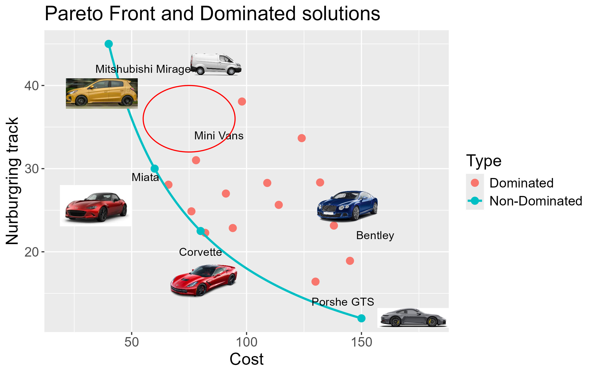

.. _moo-label:

MOO - Multi-objective Optimization
====================================
Imagine you are deciding what car to buy. You have two objectives, you'd like it to be fast (measured as time around the Nurburgring track), 
and inexpensive (measured as cost). In addition to these numerical/objective criteria, you also have subjective criteria. You'd like it 
to be comfortable, and fun to drive. The subjective criteria really can't be captured numerically. But, even for the objective criteria 
(fast and inexpensive), it might be difficult to combine these into a single number, e.g., using penalties, such as

.. math::

    Car \enspace \textit{"goodness"}  = Nürburgring \enspace   time \enspace (seconds) + \frac{Cost}{500}

In this case the "penalty" for cost is cost divided by 500. The value 500 is subjective, and somewhat of arbitrary, another person likely would chose 
a different value, and you might chose a different value after your yearly bonus (likely a larger value, as cost will no longer be an issue after 
you explain MOO to management). Further, once the optimization is done with this "fitness" function, if the value changes, you'd need to rerun 
the optimization. Multi-objective optimization is one method to address this subjective and arbitrariness. Rather than optimizing a single number, 
the optimization is performed on several objectives at once. Rather than a single "best" solution, a set of "non-dominated" solutions are presented 
to the user. The user can then consider this manageable set of solutions, rather than all possible solutions. For all of these proposed solutions, 
there will no other solutions that are better in every (objective) way. Any solutions for which another solution exists that is better in every way probably 
should not even be considered. The MOO results visualize the trade off(s) between the objectives, which allow revisiting and discussion of the optimal 
solution if the preference between the trade offs changes. A representative plot for the tradoff between two objectives (speed and cost) is depicted 
below for car performance and cost cost:

Algorithms
-----------
pyDarwin includes two MOO algorithms. The first algorithm name in the options.json file in "MOGA". This algorithm implements the 
`NSGA-II method  <https://ieeexplore.ieee.org/document/996017/>`_  from the `pymoo <https://pymoo.org/>`_ package. The advantage of this is that the 
the models are selected based on the most commonly used in population modeling, goodness of fit (the objective function value, OFV, -2log likelihood) 
parsimony (the number of estimated parameters). While the is no assurance that models with different numbers of parameters are 
hierarchical (and therefore a formal test of hypothesis can be done), it still is commonly observed that models with more parameters tend to fit 
better (have a lower OFV) and therefore a trade-off between goodness of fit and parsimony is seen, much as there is typically, among cars selected 
based on performance and cost, a trade-off between those. As the models become larger, this trade off (decrease 
in OFV for each additional parameter) tends to decrease.

 

 