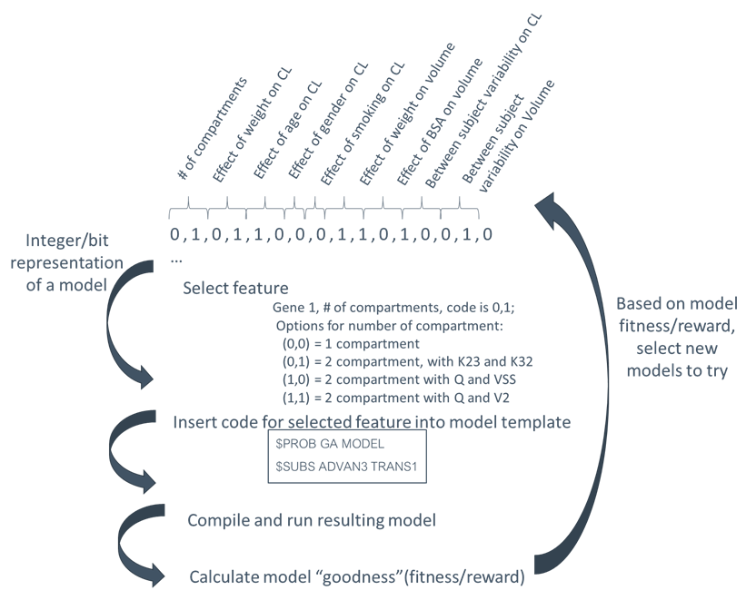

PK Model 3, ODE model
==============================================
  
 

The Template file
~~~~~~~~~~~~~~~~~~~~~

Example 3 template file :download:`text <./Example3/Example3_template.txt>`

The Tokens file
~~~~~~~~~~~~~~~~

Example 3 tokens file :download:`json <./Example3/Example3_tokens.json>`

The Options file
~~~~~~~~~~~~~~~~

Example 3 template file :download:`json <./Example3/Example3_options.json>`

.. _startpk3:

64 model search space by exhaustive

As you can see in the `startpk3`_ image,  

  