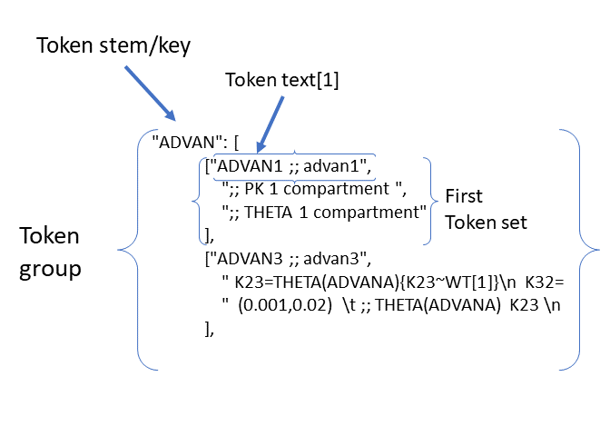
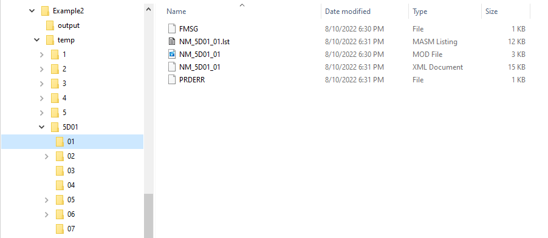

.. include:: .special.rst

##########
Usage
##########

.. _Execution:

Darwin may be executed locally, on Linux Grids, or as a combination of both e.g., execute NONMEM models on grids and run search locally. 

********************
Execution Overview
********************

Running Search on local machine
================================

The :ref:`darwin.run_search <darwin.run_search>` function executes the candidate search for the optimal population model.

.. code:: python
    
    python -m darwin.run_search <template_path> <tokens_path> <options_path>

To execute, call the ``darwin.run_search`` function and provide the paths to the following files as arguments:

1. :ref:`Template file <template_file_target>` (e.g., template.txt) - basic shell for NONMEM control files
2. :ref:`Tokens file <tokens_file_target>` (e.g., tokens.json) - json file describing the dimensions of the search space and the options in each dimension
3. :ref:`Options file <options_file_target>` (e.g., options.json) - json file describing algorithim, run options, and post-run penalty code configurations.

See :ref:`required files <startRequiredFiles>` for additional details.

Alternatively, you may execute the :ref:`darwin.run_search_in_folder <darwin.run_search_in_folder>` function, 
specifying the path to the folder containing the ``template.txt``, ``tokens.json``, and ``options.json`` files
as a single argument:

.. code:: python
    
    python -m darwin.run_search_in_folder <folder_path>

.. note::
    Files must be named as ``template.txt``, ``tokens.json``, and ``options.json`` when using :ref:`darwin.run_search_in_folder <darwin.run_search_in_folder>`.

.. _stop_search:

Stopping Execution
=========================

A running search can be stopped using following command:
.. code:: python
    
    python -m darwin.stop_search [-f] <project dir>|<options file>

You need to provide the path to the project folder or to the options file associated with the search you want to stop.
Optional flag specifies whether the search must be stopped immediatelly. If not set the search will stop after current model runs are finished.

.. warning::
   Don't force-stop GP during ask-stage <reference here>. Either wait for it to finish (``Done asking`` in the console output and/or :file:`messages.txt`) or stop w/o ``-f`` flag.

.. note::
   models.json will contain all model runs finished before interruption.

Execution on Linux Grids
=========================

The following requirements should be met in order to execute ``pyDarwin`` on Linux Grids.

* You must have access to the grid system e.g., you are able to connect to the system via terminal session.
* You must make ``pyDarwin`` installation available for all grid nodes. 
* Your search project must be available for all grid nodes as well.
* You should be familiar with your grid controller commands e.g., how to submit a job, query finished jobs, and delete jobs.
* You should be familiar with regular expressions e.g., for usage in ``"submit_job_id_re"`` and ``"poll_job_id_re"`` fields in ``options.json``.

.. note::
    If all grid nodes share the same file system you can simply deploy pyDarwin in your home directory (always use virtual environment!).

There are two ways to utilize grids for search in `pyDarwin`:

1. Run search locally, submit individual model runs to the grid (local search, grid model runs).
2. Submit search to the grid, as well as all the model runs (grid search, grid model runs).

In both cases you need to setup grid settings in your ``options.json``.

Both ways you can :ref:`stop the search <stop_search>` using ``darwin.stop_search``. Just keep in mind that in second case it may be not very responsive (due to load/IO latency/grid deployment details), so be patient.

.. note::
    Although it’s possible to submit a "local search with local model runs" to the grid, this is not suggested.

.. _running_grid_search:

Running Grid Search
---------------------

.. code:: python
    
    python -m darwin.grid.run_search <template_path> <tokens_path> <options_path>

Or alternatively, run grid search in folder:

.. code:: python
    
    python -m darwin.grid.run_search_in_folder <folder_path>

.. note::
    You must ensure that ``submit_search_command`` has been setup correctly in options.json, in addition to other grid settings.
    See :ref:`submit_search_command <submit_search_command_options_desc>`

.. _startRequiredFiles:

********************
Required Files
********************
 
 
The same 3 files are required for any search, whether exhausitve, :ref:`EX<EX_desc>`, :ref:`GA<GA_desc>`,
:ref:`GP<GP_desc>`, :ref:`RF<RF_desc>` or :ref:`GBRT<GBRT_desc>`. Which algorithm is used is defined in the 
:ref:`options file<options_file_target>`. The template  file serves as a framework, and looks similar to a 
NONMEM/NMTRAN control file. The tokens file specifies the range of "features" to be searched, and the options 
file specifies the algorithm, the fitness function, any R or Python code to be executed after the NONMEM execution,
and misc other options related to execution. See :ref:`Options List<Options>`.
 
.. _template_file_target:

Template File
=========================

The template file is a plain ASCII text file. This file is the framework for the construction of the NONMEM 
control files. Typically, the structure will be quite similar to a NONMEM control file, with all of the usual 
blocks, e.g. $PROB, $INPUT, $DATA, $SUBS, $PK, $ERROR, $THETA, $OMEGA, $SIGMA, $EST. However, this format is 
completely flexible and entire blocks may be missing from the template file (to be provided from the 
:ref:`tokens file<tokens_file_target>`)

The difference between a standard NONMEM control file and the template file is that the user will define code 
segments in the template file that will be replaced by other text. These code segments are refered to as "token keys". 
Tokens keys come in sets, and in most cases, several token keys will need to be replaced together to generate syntacatically 
correct code. The syntax for a token key in the template file is:

::

    {Token_stem[N]}

Where Token_stem is a unique identified for that token set and N is which target text is to be substituted. An 
example is instructive.

*Example:*

Assume the user would like to consider 1 compartment (ADVAN1) or 2 compartment (ADVAN3) models as a dimension of the search. 
The relevant template file for this might be:

::

    $SUBS {ADVAN[1]}
    .
    .
    $PK
    .
    .
    .
    {ADVAN[2]}
    .
    .
    .
    $THETA
    (0,1) ; Volume - fixed THETA - always appears
    (0,1) ; Clearance - fixed THETA - always appears
    {ADVAN[3]}

Note that tokens nearly always come in sets, as in nearly all cases, several substitions must be made to create correct syntax. 
For a one compartment model the following substitutions would be made:

::

    {ADVAN[1]} -> ADVAN1

::

    {ADVAN[2]} -> ;; 1 compartment, no definition needed for K12 or K21

::

    {ADVAN[3]} -> ;; 1 compartment, no initial estimate needed for K12 or K21

and for 2 compartment:

::

    {ADVAN[1]} -> ADVAN3

::

    {ADVAN[2]} -> K12 = THETA(ADVANA) ;; 2 compartment, need definition for K12 \n K21 = THETA(ADVANB) 

::

    ADVAN[3]} ->(0,0.5) ;; K12 THETA(ADVANA)  \n  (0,0.5) ;; K21 THETA(ADVANB)

Where \\n is the new line character. These sets of tokens are called tokens sets (2 tokens sets in this example one for ADVAN1, one for ADVAN3). The group of token sets 
is called a token group. In this example "ADVAN" is the token key. Each token group must have a unique token key. For the first set of options the text "ADVAN1" 
is refered to as the token text. Each token set consists of key-text pairs: 

token keys (described above) and 

token text

The token, (consisting of "{" + token stem +[N] + "}" where N is an integer specifying which token text in the token set is to be substituted) in the template file is 
replaced by the token text, specified in the tokens file. Which set of token key-text pairs is substitituted is determined by the search algorithm, and provides in 
the :ref:`phenotype.<Phenotype>`

Note that the THETA (and ETA and EPS) indices cannot be determined until the final control file is defined, as THETAs may be included in one and not another token set. 
For this reason, all fixed initial estimates in the $THETA block MUST occur before the THETA values that are not fixed. This is so the 
algorithm can parse the resulting file and correctly calculate the appropriate THETA (and ETA and EPS) indices. Further, the text string index of in the token (e.g., ADVANA and ADVANB) 
*must* be unique in the token groups. The most convenient way to ensure that the text string index is unique in the Token groups is to use the token stem as the 
THETA index (e.g., THETA(ADVAN) is the token stem is ADVAN). Additional characters (e.g., ADVANA, ADVANB) can be added if multiple THETA text indices are needed. 
Note that the permited syntax for residual error is EPS() or ERR(). 

Special notes on strucutre of $THETA/$OMEGA/$SIGMA:

Parameter initial estimate blocks require special treatment. A template file will typically include 2 types of initial estimates:

1. Fixed initial estimates - Initial estimates that are not searched, but will be copied from the template into **ALL** control files. These are the typical $THETA estimates, e.g.: (0,1)  ; THETA(1) Clearance.

2. Searched initial estimates - Initial estimates that are specified in tokens that may or may not be in any given control file. e.g.,: {ALAG[2]} where the text for the ALAG[2] token key is "(0,1) ;; THETA(ALAG) Absorption lag time"
   

There are 3 restriction for the parseing of the initial estimates blocks:

1. Fixed initial estimates **MUST** be placed before Searched Initial estimates.

2. Each parameter initial estimate must be one a separate line
   
3. Text for **ALL** initial estimates must be in parentheses, e.g., (1), or (0,1) or (0,1,5)

.. _tokens_file_target:

Tokens File
=========================

The tokens file provide a dictionary (as a JSON file) of token key-text pairs. The highest level of the dictionary is the :ref:`token group <token group>`. Token groups are 
defined by a unique :ref:`token stem<token stem>`. The token stem also typically serves as the key in the :ref:`token key-text pairs.<token key-text pair>` The token stem is 
a text string that corresponds to the token key that appears in the :ref:`template file<template>`. 
The 2nd level in the tokens dictionary are the :ref:`token sets<token set>`. In the template file the tokens are indexed (e.g., ADVAN[1]), as typically multiple token keys 
will be to be replace by text to create correct syntax. For example, if the search if for 1 compartment (ADVAN1) vs 2 compartment (ADVAN3), for ADVAN3, definitions of K23 
and K32 must be provided in the $PK block, and (typically) initial estimates must be provided in the $THETA block. Thus, a set of 3 replacements must be made, one in $SUBS, 
one in $PK and one in $THETA. So, the token set for selection of number of compartments will, for 1 compartment (first option) or 2 compartments (second option), 
will include the following JSON code:

::

    "ADVAN": [
                ["ADVAN1 ",
                    ";; 1 compartment, no definition needed for K12 or K21 ",
                    ";; 1 compartment, no initial estimate needed for K12 or K21"
                ],
                ["ADVAN3 ",
                    " K12 = THETA(ADVANA) ;; 2 compartment, need definition for K12 \n K21 = THETA(ADVANB)",
                    "  (0,0.5) ;; K12 THETA(ADVANA)  \n  (0,0.5) ;; K21 THETA(ADVANB) "
                ],

Note that whether the current model is one compartment or two is selected by the search algorithm and provided in the model :ref:`phenotype<phenotype>`.

A diagram of the token structure is given below

Note the "nested token" - a token ("{K23~WT[1]}") within a token, circled in red. Any number of levels of nested tokens is permited (but the logic becomes very difficult with more than one) 
pyDarwin will first substitute the full text 
into the template, then scans the resulting text again. This nested token will then be found and the text from the {K23~WT[1]} token set will be substituted. 

Several notes:

1. The :ref:`token stem<token stem>` is "ADVAN" and identifies the :ref:`token group<token group>`. This stem must be unique in the tokens groups. The token stem also typically 
serves as the token key in the :ref:`token key-value pairs<token key-text pair>`. In this example, three replacements must be made in the template, in $SUBS, $PK and $THETA. 
In the template file, these will be coded as {ADVAN[1]}, {ADVAN[2]} and {ADVAN[3]}. Note the curly braces, these are required in the template, but not the tokens file. The indices correspond to the indices of the :ref:`tokens<token>` in the token set. In this case there are 3 :ref:`token key-value pairs<token key-text pair>` in each token set. There may be additional unused tokens (as may be the case with :ref:`nest tokens<nested tokens>`, but each token in the template file must have a corresponding token key-value pair in the tokens file. 2 token sets in this token group, one coding for ADVAN1 and one coding for ADVAN3.

2. New lines in JSON files are ignored. To code a new line, enter the newline escape character "\\n". Similarly, a tab is coded as "\\t".

3. Comments are not permitted in JSON files. However comments for the generated NMTRAN control file maybe included with the usual syntax ";".

4. There is no dependency on the sequence of token sets in the file, any order is acceptable, they need not be in the same order as they appear in the :ref:`template file.<template_file_target>`

5. All other JSON (`JSON <https://www.json.org/json-en.html>`_ ) rules apply.

**Special note on initial estimates**

In order to parse the text in the initial estimates blocks (THETA, OMEGA and SIGMA) the user MUST include token stem text as a NONMEM/NMTRAN comment (i.e. after ";"). There is 
no other way to identify which intial estimates are to be associated with which THETA. 
E.g, if an token stem as two THETAs:

::

    Effect = THETA(EMAX) * CONC/(THETA(EC50) + CONC)

for the text in the $PK block, then code to be put into the $THETA block will be:

The resulting $THETA block for this initial feature MUST be similar to this:

::

 "  (0,100) \t; THETA(EMAXs) "
 "  (0,1000) \t; THETA(EC50) "

Where \\t is a tab. Without this THETA(EMAX) and THETA(EC50) as a comment, there would not be any way to identify which initial estiamate is to be associated with which 
THETA. Note that NONMEM assigns THETAs by sequence of appearance in $THETA. Given that the actual indices for THETA cannot be determined until the control file 
is created, this approach would lead to ambiguity. Each initial estimate must be on a new line and include the THETA (or ETA or EPS) + parameter identifier.

.. _options_file_target:

Options File
=========================

A JSON file with key-value pairs specifying various options for executing pyDarwin. While some fields are mandatory, some are
algorithim specific, while others are only relevant for execution on Linux grids.

See :ref:`Options List<Options>` for details.

********************
pyDarwin Outputs
********************

Console output
=========================

When pyDarwin first starts, it starts by confirming that key files are available. These files include:

#. The template file
#. The tokens file
#. The options file
#. nmfe??.bat - executes NONMEM
#. The data file(s) for the first control that is intiated
#. If post run R code is requested, Rscript.exe

The start up output also lists the location of:
 
#. Data dir - folder where datasets are located. It is recommended that this be an absolute path
#. Project working dir - folder where template, token and options files are located, this is not set by the user
#. Project temp dir - root folder where model file will be found, if the option is not set to remove them
#. Project output dir - folder where all the files that considered as results will be put, such as results.csv and Final* files. 
#. Where intermediate output will be written (e.g. u:/user/example2/output\results.csv)
#. Where models will be saved to (e.g., u:/user/example2/working\models.json)
#. NMFE??.bat (Windows) or nmfe?? (Linux) file
#. Rscript.exe, if used

When run from command line (`or from Visual Studio Code <https://code.visualstudio.com/>`_) pyDarwin provides significant output about whether individual models 
have executed successfully. A typical line of output might be::

    [16:22:11] Iteration = 1, Model     1,       Done,    fitness = 123.34,    message =  No important warnings

The columns in this output are::
    
    [Time of completion] Iteration = Iteration/generation, Model     Model Number,       Final Staus,    fitness = fitness/reward,    message =  Messages from NMTRAN

If there are messages from NONMEM execution, these will also be written to command line, as well as if excecution failed, and, if request, if R execution failed.

If the :ref:`"remove_temp_dir" <remove_temp_dir_options_desc>` is not set to true, the NONMEM control file, output file and other key files can be found in {temp_dir}\Iteration/generation\Model Number for debugging. 

File output
=========================

The file output from pyDarwin is generated real time. That is, as soon as a model is finished, the results are written to the results.csv and models.json files. Similarly, 
messages (what appears on the command line output) is written continuously to the messages.txt file.

**NOTE**. As these files are continuous opened, written to and closed, an exception will occur if they are opened in an application the "locks" them, e.g. Excel. If, for example 
the results.csv file is opened in Excel, the next time pyDarwin trys to open it to write the next model output, an exception will occur. The work around is to copy the file to 
another file (e.g., cp results.csv results1.csv), then open the copied file.

Messages.txt
--------------

The messages.txt file will be found in the working dir. This file contents is the same as that output to the command line

models.json
--------------

The models.json will contain the key output from all models that are run. This is not a very user friendly file, as it is fairly complex json. The primary (maybe only) use 
for this file is if a search is interupted, it can be restarted, and the contents of this file read in, rather than rerunning all of the models. If the goal is to make simple diagnostics 
of the search progress, the results.csv file is likely more useful.

results.csv
--------------

The results.csv file contains key information about all models that are run in a more user-friendly format. This file can be used to make plots to monitor progress of the search 
or to identify models that had unexpected results (Crashes)

File Structure and Naming
==========================

NONMEM control, executable and output file naming

Saving NONMEM outputs
-----------------------
NONMEM generates a great deal of file output. For a search of perhaps up to 10,000 models, this can become an isssue for disc space. 
By default, key NONMEM output files are retained. Most temporary files (e.g., FDATA, FCON) and the temp_dir are always removed to save disc space. 
In addition, the data file(s) are not copied to the run directory, but all models use the same copy of the data file(s).
Care should be take to not generate unneeded table files, as these can become quite large, and will not be removed by pyDarwin. 

File Structure
----------------
Three user define file locations can be set in the :ref:`options file<Options>`. In addition to the fodlers that are user defined
the project directory (project_dir) is the folder where template, token and options files are located. The user define folders are:

#. output_dir - Folder where all the files that considered as results will be put, such as results.csv and Final* files. Default value is working_dir/output. May make sense to be set to project_dir if version control of the project and the results is intended.

#. temp_dir - NONMEM models are run in subfolders of this folder Default value is working_dir/temp. May be deleted after search finished/stopped if remove_temp_dir is set to true.  

#. working_dir - Folder where all intermediate files will be created, such as models.json (model run cache), messages.txt (log file), Interim* files and stop files. Default value - %USER_HOME%/pydarwin/project_name where project name is defined in the :ref:`options file<Options>`
 

Model/folder naming
--------------------

A model stem is generated from the current generation/iteration and model number or the form NM_genration_model_num. For example, if this is iteration 2, model 3 the model stem would be 
NM_2_3. For the 1 bit downhill, the model stem is NM_generationDdownhillstep_modelnum, and for the 2 bit local search the model stem is NM_generationSdownhillstepSearchStep_modelnum. Final downhill 
model stem is NM_FNDDownhillStep_ModelNum. This model stem is then used to name the .exe file, the .mod file, the .lst file etc. This results in unique names for all models in the search. Models 
are also frequently duplicated. Duplicated files are not rerun, and so those will not appear in the file structure.

Run folders are similarly named for the generation/iteration and model number. Below is a folder tree for :ref:`Example 2<startpk2>`

Saving models
---------------

Model results are by default saved in a JSON file so that searches can be restarted or rerun with different algorithms more efficients. The name of the saved JSON file can be set by the user. A .csv 
file describing the course of the search is also save to results.csv. This file can be used to monitor the progress of the search. 
