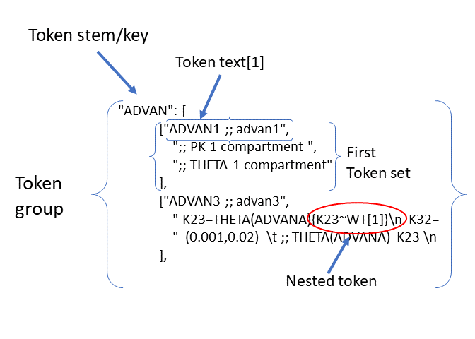

Usage
========

The :ref:`darwin.run_search <darwin.run_search>` function executes the candidate search for the optimal population model.

.. code:: python
    
    python -m darwin.run_search <template_path> <tokens_path> <options_path>

To execute, call the ``darwin.run_search`` function and provide the following file paths as arguments:

1. :ref:`Template file <template_file_target>` (e.g., template.txt) - basic shell for NONMEM control files
2. :ref:`Tokens file <tokens_file_target>` (e.g., tokens.json) - json file describing the dimensions of the search space and the options in each dimension
3. :ref:`Options file <options_file_target>` (e.g., options.json) - json file describing algorithim, run options, and post-run penalty code configurations.

.. _startRequiredFiles:
 
 
The same 3 files are required for any search, whether exhausitve, :ref:`EX<EX_desc>` , :ref:`GA<GA_desc>` , :ref:`GP<GP_desc>`, :ref:`RF<RF_desc>` or :ref:`GBRT<GBRT_desc>`. 
Which algorithm is used is defined in the :ref:`options file<options_file_target>`. The template 
file serves as a framework, and looks similar to a NONMEM/NMTRAN control file. The tokens file specifies the range of "features" to be searched, and the options 
file specifies the algorithm, the fitness function, any R or Python code to be executed after the NONMEM execution etc.
 
.. _template_file_target:

Template File
~~~~~~~~~~~~~~~~~~~
The template file is a plain ASCII text file. This file is the framework for the construction of the NONMEM control files. 
Typically, the structure will be quite similar to a NONMEM control file, with all of the 
usual blocks, e.g. $PROB, $INPUT, $DATA, $SUBS, $PK, $ERROR, $THETA, $OMEGA, $SIGMA, $EST. However, this format is 
completely flexible and entire blocks may be missing from the template file (to be provided from the  :ref:`tokens file<tokens_file_target>`)

The difference between a standard NONMEM control file and the temlate file is that the user will define code 
segments in the template file that will be replaced by other text. These code segments are refered to as "token keys". 
Tokens keys come in sets, as in most case several code segements will need to be replace together to generate syntacatically 
correct code. The syntax for a token key in the template file is:

::

    {Token_stem[N]}

Where Token_stem is a unique identified for that token set and N is which target text is to be substituted. An 
example is instructive.

Assume the user would like to consider 1 compartment (ADVAN1) or 2 compartment (ADVAN3) models as a dimension of the search. 
The relevant template file for this might be:

::

    $SUBS {ADVAN[1]}
    .
    .
    $PK
    .
    .
    .
    {ADVAN[2]}
    .
    .
    .
    $THETA
    (0,1) ; Volume - fixed THETA - always appears
    (0,1) ; Clearance - fixed THETA - always appears
    {ADVAN[3]}

Note that tokens nearly always come in sets, as in nearly all cases, several substitions must be made to create correct syntax. 
For a one compartment model the following substutions would be made:

{ADVAN[1]} -> ADVAN1

{ADVAN[2]} -> ;; 1 compartment, no definition needed for K12 or K21

{ADVAN[3]} -> ;; 1 compartment, no initial estimate needed for K12 or K21

and for 2 compartment:

{ADVAN[1]} -> ADVAN3

{ADVAN[2]} -> K12 = THETA(ADVANA) ;; 2 compartment, need definition for K12 \n K21 = THETA(ADVANB) 

{ADVAN[3]} ->(0,0.5) ;; K12 THETA(ADVANA)  \n  (0,0.5) ;; K21 THETA(ADVANB)

These sets of tokens are called tokens sets (2 tokens sets in this example one for ADVAN1, one for ADVAN3). The group of token sets 
is called a token group. In this example "ADVAN" is the token key. Each token group must have a unique token key. For the first set of options the text "ADVAN1" 
is refered to as the token text. Each token set consists of key-text pairs: 

token keys (described above) and 

token text

The token, (consisting of "{" + token stem +[N] + "}" where N is an integer specifying which token text in the token set is to be substituted) in the template file is 
replaced by the token text, specified in the tokens file. Which set of token key-text pairs is substitituted is determined by the search algorithm, and provides in 
the :ref:`phenotype.<Phenotype>`

Note that the THETA (and ETA and EPS) indices cannot be determined until the final control file is defined, as THETAs may be included in one and not another token set. 
For this reason, all fixed initial estimates in the $THETA block MUST occur before the THETA values that are not fixed. This is so the 
algorithm can parse the resulting file and correctly calculate the appropriate THETA (and ETA and EPS) indices. Further, the text string index of in the token (e.g., ADVANA and ADVANB) 
*must* be unique in the token groups. The most convenient way to insure that the text string index is unique in the Token groups is to use the token stem as the 
THETA index (e.g., THETA(ADVAN) is the token stem is ADVAN). Additional characters (e.g., ADVANA, ADVANB) can be added if multiple THETA text indices are needed. 
Note that the permited syntax for residual error is EPS() or ERR(). 

Special notes on strucutre of $THETA/$OMEGA/$SIGMA:

Parameter initial estimate blocks require special treatment. A template file will typically include 2 types of initial estimates:

1. Fixed initial estimates - Initial estimates that are not searched, but will be copied from the template into **ALL** control files. These are the typical $THETA estimates, e.g.: (0,1)  ; THETA(1) Clearance.

2. Searched initial estimates - Initial estimates that are specified in tokens that may or may not be in any given control file. e.g.,: {ALAG[2]} where the text for the ALAG[2] token key is "(0,1) ;; THETA(ALAG) Absorption lag time"
   

There are 3 restriction for the parseing of the initial estimates blocks:

1. Fixed initial estimates **MUST** be placed before Searched Initial estimates.

2. Each parameter initial estimate must be one a separate line
   
3. Text for **ALL** initial estimates must be in parentheses, e.g., (1), or (0,1) or (0,1,5)

.. _tokens_file_target:

The Tokens File
~~~~~~~~~~~~~~~

The tokens file provide a dictionary (as a JSON file) of token key-text pairs. The highest level of the dictionary is the :ref:`token group <token group>`. Token groups are 
defined by a unique :ref:`token stem<token stem>`. The token stem also typically serves as the key in the :ref:`token key-text pairs.<token key-text pair>` The token stem is 
a text string that corresponds to the token key that appears in the :ref:`template file<template>`. 
The 2nd level in the tokens dictionary are the :ref:`token sets<token set>`. In the template file the tokens are indexed (e.g., ADVAN[1]), as typically multiple token keys 
will be to be replace by text to create correct syntax. For example, if the search if for 1 compartment (ADVAN1) vs 2 compartment (ADVAN3), for ADVAN3, definitions of K23 
and K32 must be provided in the $PK block, and (typically) initial estimates must be provided in the $THETA block. Thus, a set of 3 replacements must be made, one in $SUBS, 
one in $PK and one in $THETA. So, the token set for selection of number of compartments will, for 1 compartment (first option) or 2 compartments (second option), 
will include the following JSON code:

::

    "ADVAN": [
                ["ADVAN1 ",
                    ";; 1 compartment, no definition needed for K12 or K21 ",
                    ";; 1 compartment, no initial estimate needed for K12 or K21"
                ],
                ["ADVAN3 ",
                    " K12 = THETA(ADVANA) ;; 2 compartment, need definition for K12 \n K21 = THETA(ADVANB)",
                    "  (0,0.5) ;; K12 THETA(ADVANA)  \n  (0,0.5) ;; K21 THETA(ADVANB) "
                ],

Note that whether the current model is one compartment or two is selected by the search algorithm and provided in the model :ref:`phenotype<phenotype>`.

A diagram of the token structure is given below

Note the "nested token" - a token ("{K23~WT[1]}") within a token, circled in red. One level of nested tokens is permited. pyDarwin will first substitute the full text 
into the template, then scans the resulting text again. This nested token will then be found and the text from the {K23~WT[1]} token set will be substituted. 

Several notes:

1. The :ref:`token stem<token stem>` is "ADVAN" and identifies the :ref:`token group<token group>`. This stem must be unique in the tokens groups. The token stem also typically 
serves as the token key in the :ref:`token key-value pairs<token key-text pair>`. In this example, three replacements must be made in the template, in $SUBS, $PK and $THETA. 
In the template file, these will be coded as {ADVAN[1]}, {ADVAN[2]} and {ADVAN[3]}. Note the curly braces, these are required in the template, but not the tokens file. The indices correspond to the indices of the :ref:`tokens<token>` in the token set. In this case there are 3 :ref:`token key-value pairs<token key-text pair>` in each token set. There may be additional unused tokens (as may be the case with :ref:`nest tokens<nested tokens>`, but each token in the template file must have a corresponding token key-value pair in the tokens file. 2 token sets in this token group, one coding for ADVAN1 and one coding for ADVAN3.

2. New lines in JSON files are ignored. To code a new line, enter the newline escape character "\\n". Similarly, a tab is coded as "\\t".

3. Comments are not permitted in JSON files. However comments for the generated NMTRAN control file maybe included with the usual syntax ";".

4. There is no dependency on the sequence of token sets in the file, any order is acceptable, they need not be in the same order as they appear in the :ref:`template file.<template_file_target>`

5. All other JSON (`JSON <https://www.json.org/json-en.html>`_ ) rules apply.

.. _options_file_target:

Options File
~~~~~~~~~~~~~~~~~~~

.. code:: json

    {
    "author": "Charles Robert Darwin",
    "project_name": "Delicious armadillos",

    "algorithm": "GA",

    "GA": {
        "elitist_num": 2,
        "crossoverRate": 0.95,
        "mutationRate": 0.95,
        "sharing_alpha": 0.1,
        "selection": "tournament",
        "selection_size": 2,
        "crossoverOperator": "cxOnePoint",
        "mutate": "flipBit",
        "attribute_mutation_probability": 0.1,
        "niche_penalty": 10
    },

    "random_seed": 11,
    "num_parallel": 4,
    "num_generations": 6,
    "population_size": 4,

    "num_opt_chains": 4,

    "exhaustive_batch_size": 100,

    "crash_value": 99999999,

    "penalty": {
        "THETA": 10,
        "OMEGA": 10,
        "SIGMA": 10,
        "convergence": 100,
        "covariance": 100,
        "correlation": 100,
        "conditionNumber": 100,
        "non_influential_tokens": 0.00001
    },

    "downhill_period": 2,
    "num_niches": 2,
    "niche_radius": 2,
    "local_2_bit_search": true,
    "final_downhill_search": true,

    "nmfePath": "/opt/nm751/util/nmfe75",
    "model_run_timeout": 1200,
    "model_run_priority_class": "below_normal",

    "postprocess": {
        "useR": true,
        "RScriptPath": "/some/R/path/rscript",
        "postRunRCode": "{project_dir}/simplefunc.r",
        "R_timeout": 30,
        "usePython": true,
        "postRunPythonCode": "{project_dir}/../simplefunc_common.py"
    },

    "use_saved_models": false,
    "saved_models_file": "{working_dir}/models0.json",
    "saved_models_readonly": false,

    "remove_run_dir": false,
    "remove_temp_dir": true,

    "model_run_man": "darwin.GridRunManager",
    "model_cache": "darwin.MemoryModelCache",
    "grid_adapter": "darwin.GenericGridAdapter",
    "engine_adapter": "nonmem",

    "working_dir": "~/darwin/Ex1",
    "data_dir": "{project_dir}/data",
    "output_dir": "{project_dir}/output",
    "temp_dir": "{working_dir}/temp",

    "generic_grid_adapter": {
        "python_path": "~/darwin/venv/bin/python",
        "submit_search_command": "qsub -b y -o {project_dir}/out.txt -e {project_dir}/err.txt -N '{project_name}'",
        "submit_command": "qsub -b y -o {results_dir}/{run_name}.out -e {results_dir}/{run_name}.err -N {job_name}",
        "submit_job_id_re": "Your job (\\w+) \\(\".+?\"\\) has been submitted",
        "poll_command": "qstat -s z",
        "poll_job_id_re": "^\\s+(\\w+)",
        "poll_interval": 5,
        "delete_command": "qdel {project_stem}-*"
    }
    }

Description of the options is given in :ref:`Options<Options>`.

Note that the the options are saved to a json file. Json supports string, numeric and Boolen (true|false)
Options include

author: String, Author, currently not used, Default - blank

homeDir: String, Linux style for the home directory, generation/interation subfolders will be placed here, Required

algorithm: String, Required GA (
:ref:`GA_desc`) EX (
:ref:`EX_desc`) GP (
:ref:`GP_desc`) RF (
:ref:`RF_desc`) GBRT (
:ref:`GBRT_desc`). Which algorithm to use.

random_seed: Integer, required if using GA/GP/RF or GBRT, 

population_size: Integer, required if using algorithm other than exhaustive search

nmfePath: String, required, path to nmfe??.bat file. Currently supported are nmfe74.bat and nmfe75.bat. 

num_parallel: Integer, optional. Number of NONMEM models to run in parallel, Default = 4

num_generations: Integer, required if using GA/GP/RF or GBRT

niche_penalty: Numeric, required if using GA. Require for calculation of the crowding penalty. 
The niche penalty is calculate by first calculating the "distance matrix", the pair wise Mikowski distance (https://en.wikipedia.org/wiki/Minkowski_distance) from the present model to all other models in the generation. 
The "crowding" quantity is then calculated a the sum of:
1 - (distance/niche_radius)**sharing_alpha for all other models in the generation for which the Mikowski distance is less than the niche radius. 
Finally, the penalty is calculated as:
exp((crowding-1)*niche_penalty)-1
The objective of using a niche penalty is to maintain diversity of models, to avoid premature convergence of the search, by penalizing when models are too 
similar to other models in the current generation.
A typical value for the penalty is 10.

num_niches: Integer, required if using GA.

niche_radius: Numeric, required if using GA. A typical value for niche_radius is 2.

THETAPenalty: Numeric, required  

OMEGAPenalty: Numeric, required  

SIGMAPenalty: Numeric, required  

conditionNumberPenalty: Numeric, required   

covariancePenalty: Numeric, required 

covergencePenalty: Numeric, required 

correlationLimit: Numeric, required

correlationPenalty: Numeric, required. Penalty if the absolute value of any off diagonal of the OMEGA matrix exceeds correlationLimit

crash_value: numeric, required. The fitness/reward value to assign to a model that fails to complete. Typical value is 99999999, should be larger than that 
expected from any model that does complete.  

crossoverRate: 0.95, 

downhill_q:5,

elitist_num: 4,

mutationRate: 0.95, 

attribute_mutation_probability: 0.1, 

input_model_json: None, 

max_model_list_size: Integer, required. The algorithm generates models in batches. For exhausitve search in particular, this may result in a very large number of 
model (100,000's?). This can lead to memory issues with a very large array of large objects. To address this, the user can (and should) define that only a 
limited number of models will be gnerated at a time, all those model run, then the list recreated. A typical value for a capable computer is 10,000.

mutate: string, required for GA. What method to use for mutation, only available option is flipBit

non_influential_tokens_penalty: 0.00001,

remove_run_dir: Boolean, options (false), Delete entire run directory. By default, all F*, WKS* file, the executable file and other non-essential files will be deleted.
NONMEM $TABLE files (unless deleted as F* or WKS*) will be retained. If large $TABLE files are written for each run, a great deal of disk space can be required. If $TABLE 
file are needed to postRunRCode, they can be deleted in the user provided R code to preserve disc space.

fullExhaustiveSearch_qdownhill: Boolean, required. The option exists to run a local exhausitve search with 2 bit radius after each dowhill search. Note that for large dimension 
search space, this can be time consuming. The number of models in each step is (dimension*dimension)/2 + dimension/2, where dimension is the number of bits Required
to define the search space.

final_fullExhaustiveSearch:  Boolean, required. The option exists to run a local exhausitve search with 2 bit radius at the end of the search. Note that for large dimension 
search space, this can be time consuming. The number of models in each step is (dimension*dimension)/2 + dimension/2, where dimension is the number of bits Required
to define the search space.

selection: string, required for GA. The algorithm used for the selection step in GA, only currently available algorithm is tournament.

selection_size: integer, required for GA. How many "parents" to select for the tournament  

sharing_alpha: 0.1,  

timeout_sec: numeric (seconds), optional(1200);. NONMEM run will be terminated (and result will be CRASH) if run time exceeds this. 

useR: boolean, optional (false). Whether to call user provided R code after each NONMEM run. If true, postRunRCode must provide path to R code

postRunRCode: string, required if useR is true. Path to R code to be run after each NONMEM run. Required return values a vector of 
length 2. The first will be a numeric (or character that can be cast as numeric) that will be added to the fitness/reward values. The 2nd is a character 
string that will be appended to the NONMEM output file.

usePython: boolean, optional (false). Whether to call user provided Python code after each NONMEM run. If true, postRunPythonCode must provide path to R code   

postRunPythonCode: string, required if usePython is true.  
crossoverOperator: cxOnePoint ,

NM_priority_class: string, optional, default = normal. Recommended to maintain interface responsiveness is below_normal,

search_omega_bands: false,

max_omega_band_width: integer, required if seach_omega_bands is true. Unfortunately is was not possible to query the temlate file and token groups to, in general,
determine the maximum size of all $OMEGA blocks. Therefore, the user is required to provide the maximum number of off diagonal bands that would be searched. This is 
required to determine the number of bits to be included in the bit string/search space.

